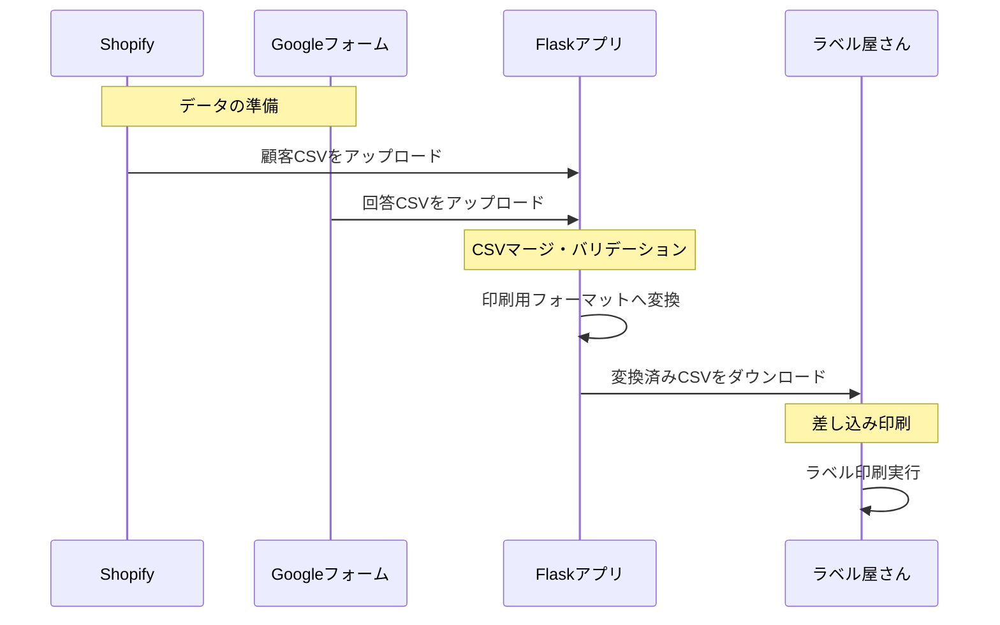

# DMラベル一括作成アプリ (LabelMaster)

## 概要
ShopifyおよびGoogleフォームからエクスポートした顧客データを取り込み、「ラベル屋さん」の差し込み印刷用フォーマットへ一括変換するWEBアプリケーションです。

## 目的
販売員が自由な形式でフォームを作成できる柔軟性を保ちつつ、管理者が行うDM発送のためのデータ統合・ラベル印刷作業を自動化し、人為的ミスを排除して工数を大幅に削減します。

## 目標
* データのコピペ作業を完全に廃止し、アップロードとCSV変換の2ステップで完結させる。
* 手作業で発生していた住所不明や転記ミスをゼロにする。

## 成果物
* DMラベル作成用 Flask ウェブアプリケーション
* データ集約・整形ロジック (Pandas/Python)

## プロジェクト構成

label-print-app/  
├── app.py              &emsp;(Flaskメインプログラム)  
├── requirements.txt    &emsp;(必要なライブラリ)  
├── uploads/            &emsp;(CSV一時保存用)  
├── templates/          &emsp;(フロントエンドHTML)  
└── README.md           &emsp;(本ドキュメント)  
  
  
## システム構成図

```
```


## 制約
- Googleフォームは配布した「固定項目付きテンプレート」を使用すること。
- 固定項目（氏名・住所等）の列順序は変更不可。
- 顧客データはサーバーに保存せず、処理完了後に破棄する（メモリ内処理）。
- 
## 期限
- プロトタイプ完了：2026年XX月XX日
- 本稼働開始：2026年XX月XX日

## 作業効率化：  
Before (現在)  
- データ整理手作業でコピペ
- 加工アップロードのみで自動生成ミス発生率人為的ミスあり
  
After (本アプリ導入後)  
- 自動処理でゼロ所要時間30分以上1分以内ROI（投資利益率）
- 印刷準備工数の90%削減。
- 月間10時間分の人件費を他のクリエイティブ業務へ転換可能。

## ROAS（広告費用対効果）
- 発送スピードの向上により、イベント告知からDM到着までのリードタイムを短縮。
- 機会損失を防ぎ、イベント参加率・リピート率の最大化を狙う。
---

## 次のアクション
